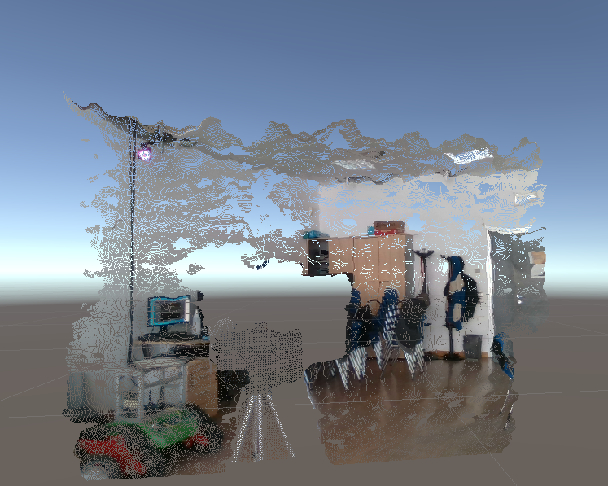
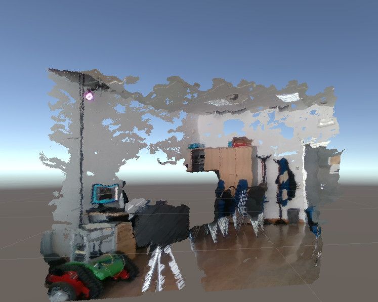
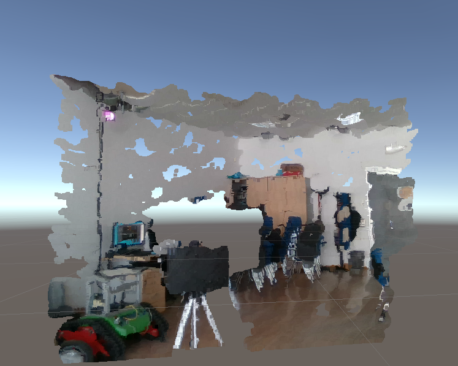
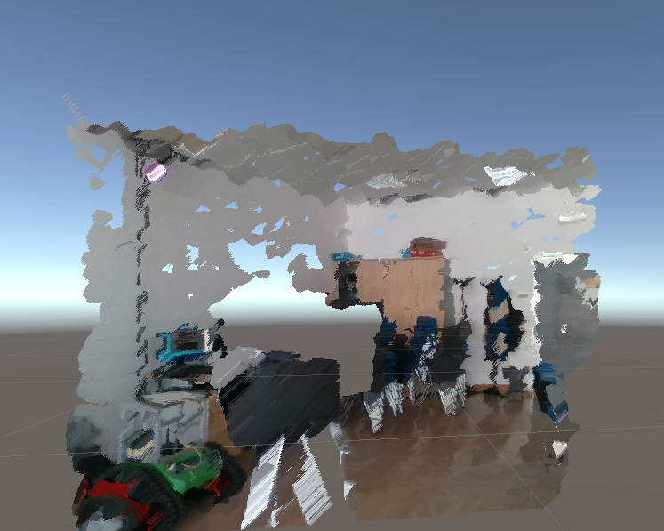
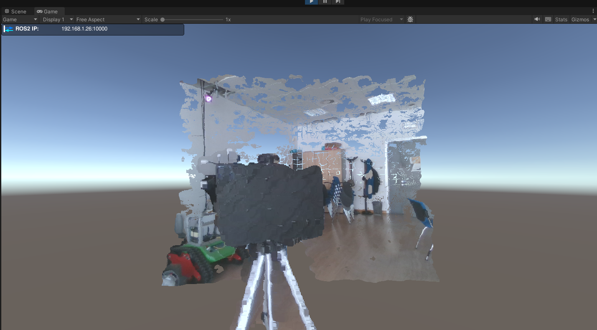
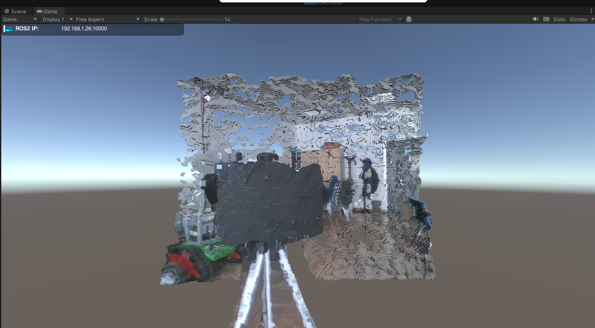
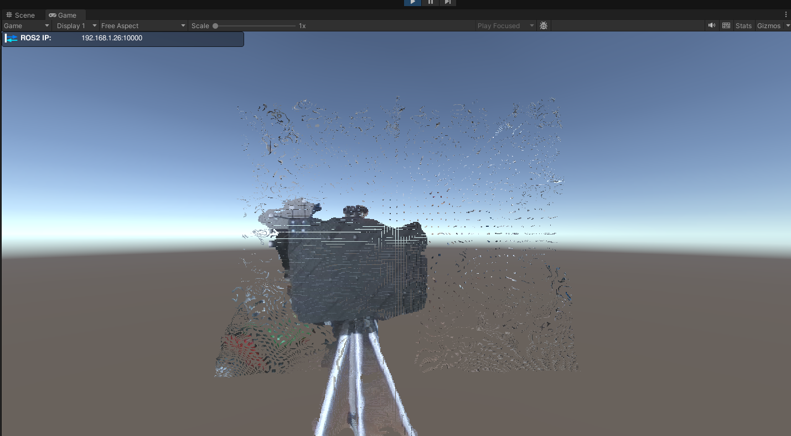
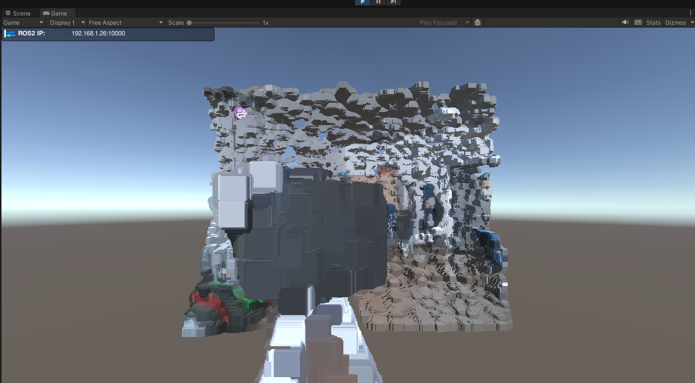
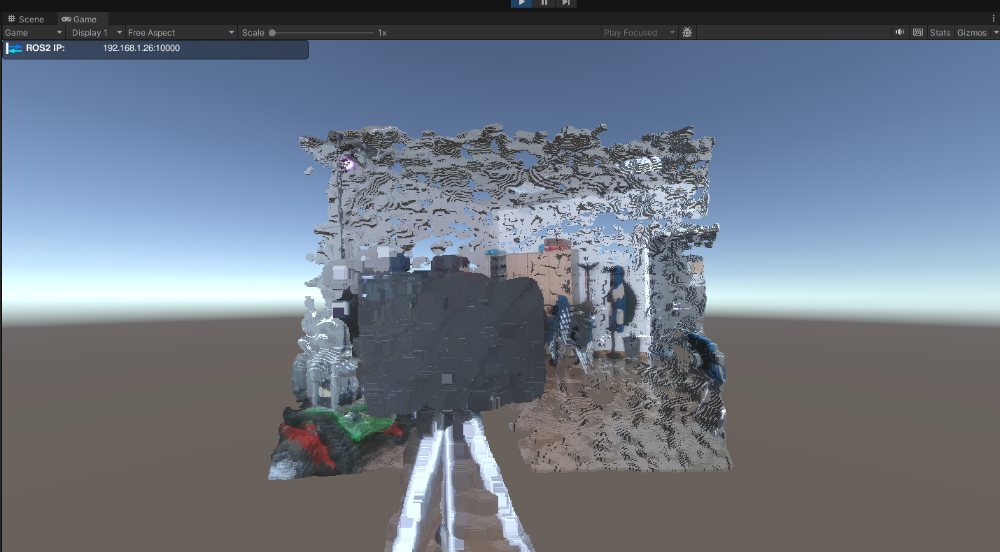
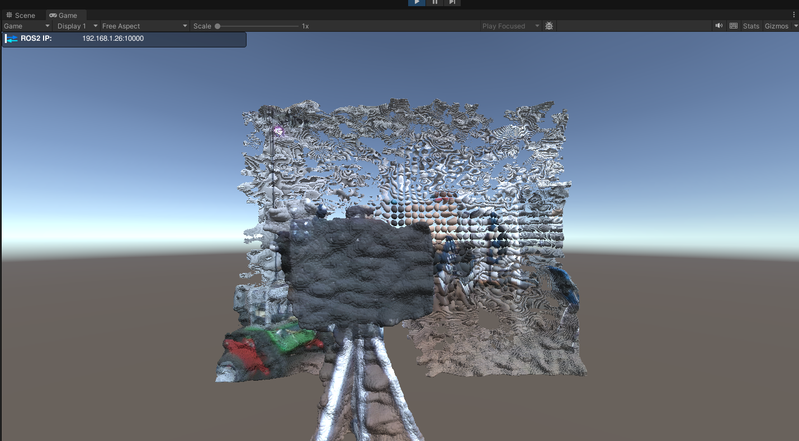

# PointCloud2Unity
A Unity package containing different possible implementations for visualizing the PointCloud2 data coming from ROS2 through the TCP-Connector.


### Proposed methods:
1. Creating a single mesh with all the points. Then each point will render a triangle or a disc using the geometry shader. [[1](#references)]
2. Exploit GPU Instancing and render directly each points as a single mesh (quad, cube, sphere, ...). [[2](#references)]
3. Variant of method 2 in which `ComputeBuffers` are used to store the data and then render the points.[[2](#references),[3](#references)]

Each methods uses a particular shader which is located in the same folder of the script.

## Method 1
This method creates a single mesh with all the points. Then points will render a triangle or a sphere using the geometry shader.
This approach seems to be the most performant, but does not have the possibility to draw quads, cubes or other shapes. The material is inherited from the `PCL` GameObject, so it is possible to switch from points to triangles and viceversa directly from the inspector. This will cause the material to change from `PointMeshShader` to `TriangleMeshShader` and viceversa.

### Preview
<table>
    <tr>
        <td> <b>Points</b> </td>
        <td> <b>Triangles</b> </td>
    </tr>
        <td>  </td>
        <td>  </td>
    <tr>
    <td> <b>Larger Points</b> </td>
    <td> <b>Larger Triangles</b> </td>
    </tr>
        <td>  </td>
        <td>  </td>
    <tr>
</table>


## Methods 2 and 3
These approaches exploit GPUs parallelism to render each point as a single mesh (quad, cube, sphere, ...). This is done using the `Graphics.RenderMeshInstanced` function.  `MaterialPropertyBlock` is also used to set different parameters value in the shaders. The material must be provided as argument in the inspector tab of the script. 
For `Method 2` the material is called `PC2GPUMaterial`, for `Method 3` the material is called `BufferedMaterial`.
### Preview
You can modify the scale of the meshes used to represent each points from the Inspector.
<table>
    <tr>
        <td> <b>Quads</b> </td>
        <td> <b>Cubes</b> </td>
        <td> <b>Spheres</b> </td>
    </tr>
        <td>  </td>
        <td>  </td>
        <td>  </td>
    <tr>
    <td> <b> Larger Quads</b> </td>
    <td> <b> Larger Cubes</b> </td>
    <td> <b> Larger Spheres</b> </td>
    </tr>
        <td>  </td>
        <td>  </td>
        <td>  </td>
    <tr>
</table>

## How to use it:
### ROS Users:
1. Install the ROS-TCP-Connector package from [here](https://github.com/Unity-Technologies/ROS-TCP-Connector) and ROS-TCP-Endopoint ros-package from [here](https://github.com/Unity-Technologies/ROS-TCP-Endpoint). You can follow [this](https://github.com/Unity-Technologies/Unity-Robotics-Hub/blob/main/tutorials/quick_setup.md) guide.
2. Set up the ROS-TCP-Connector and ROS-TCP-Endpoint to communicate with your ROS2 environment.
3. Clone this repository and open the project in Unity.
4. open one of the `Method` scene.  
5. Set your topic name and other options in the script inspector of the `PCL` object.
6. Activate <b>Use Normals</b> if your PointCloud2 message contains normals.  
    (You can check if it does by running:  
        ```ros2 topic echo /your_topic_name```   
        in your terminal and look for the field `normals_`. If it is present, then you can activate the option.)
     This will modify offsets of data in the pointcloud decoder.  
7. Run the scene and you should see the pointcloud being visualized in Unity.

### Non-ROS Users:
In this case you have to write your own code to fill the MeshInfo struct. You can look how I decoded the PointCloud2 message in the `PointCloud2Decoder` script for a reference. Then you can pass your Decoder as a parameter to the main script associated to the method you want to use.


## Common Parameters
The three methods share some common parameters:
- Vertices Max: The maximum number of vertices that will be extracted from the pointcloud for visualization.
- Topic Name: The name of the topic you want to visualize.
- Use Normals: If the pointcloud contains normals, this will modify the offsets of the data in the pointcloud decoder algorithm.
- Point size: The size of the verteces/meshes (works in real time)
Normals are also used in Method 1 to rotate triangles towards the camera.


## Tips for improving performances
- Preprocess the pointcloud filtering some points. An simple example with segmentation + voxel grid is provided [here](https://github.com/Hydran00/PC2-Filter-ROS2).


## References
For this project I took inspiration from the following repositories/websites:  
[1]: [Pcx](https://github.com/keijiro/Pcx)  
[2]: [GPU Instancing tutorial](https://toqoz.fyi/thousands-of-meshes.html)  
[3]: [PointCloud Processing tutorial](https://sketchfab.com/blogs/community/tutorial-processing-point-cloud-data-unity/)  
[4]: [PointCloud Streaming](https://github.com/inmo-jang/unity_assets/tree/master/PointCloudStreaming)  
[5]: [Vertex Point Cloud](https://github.com/keenanwoodall/VertexPointCloud/tree/master)  
