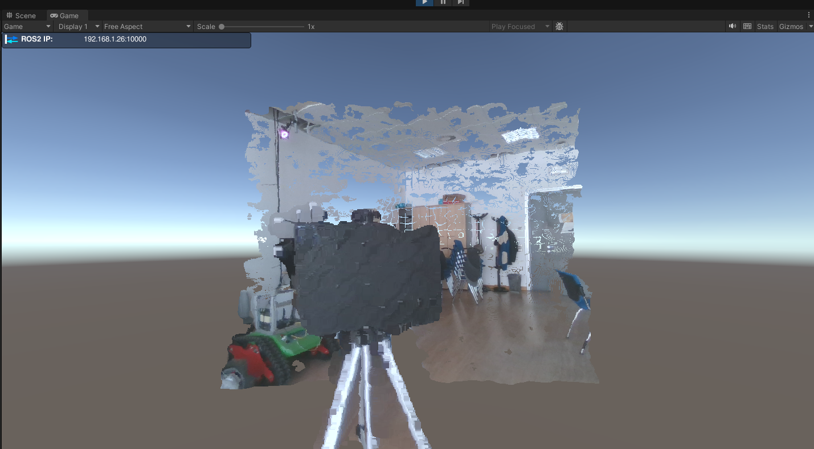
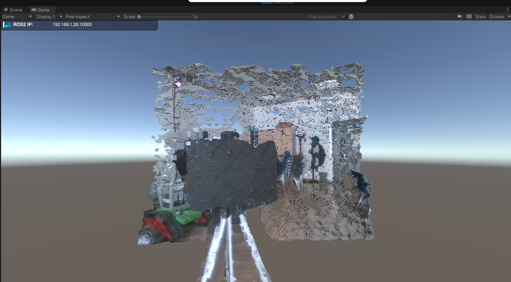
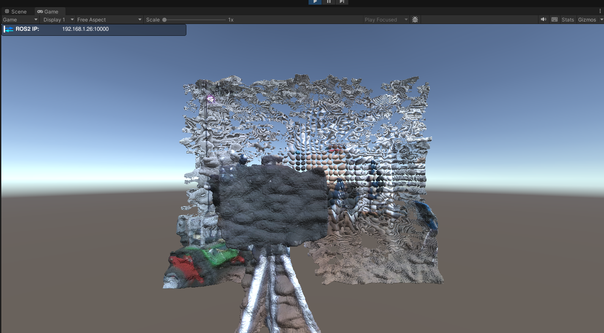
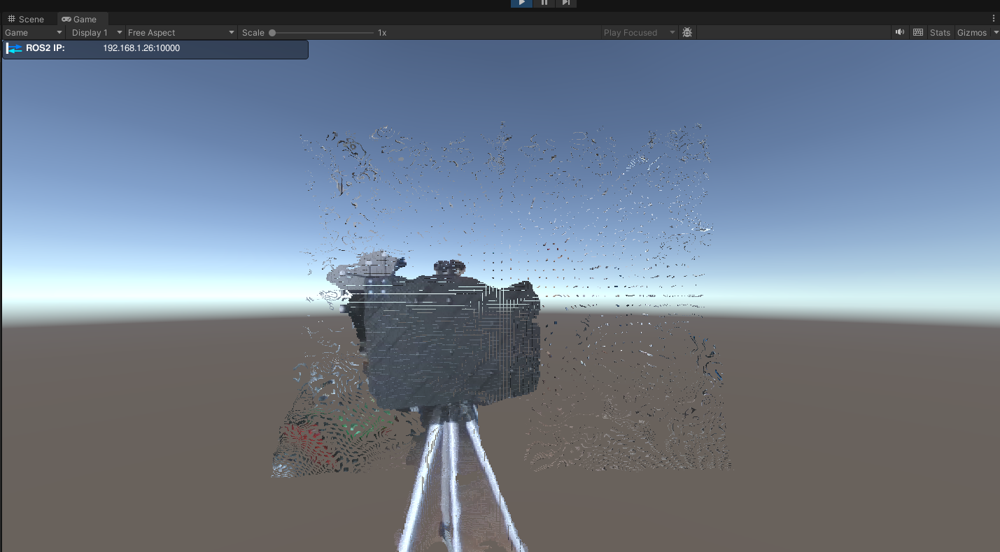
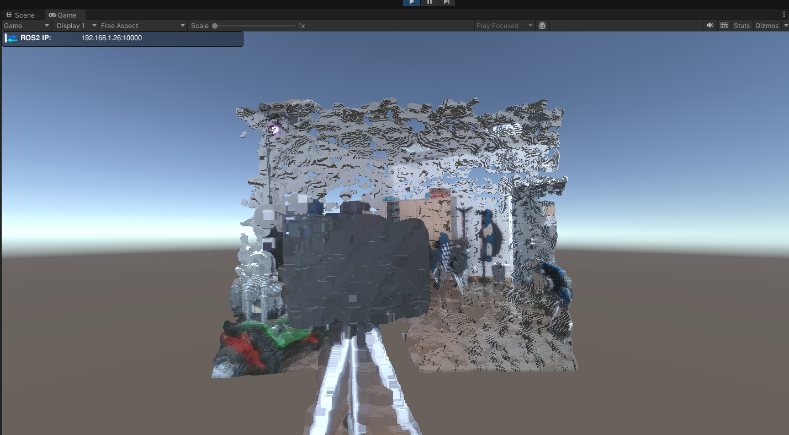
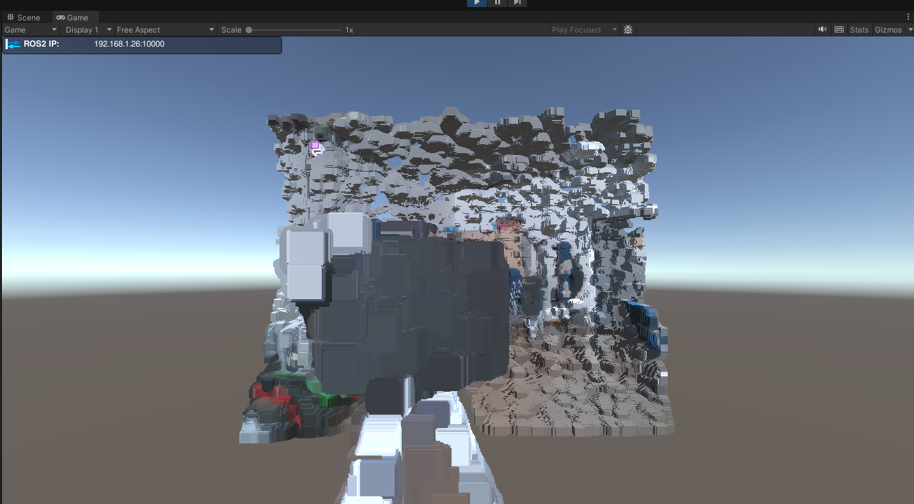

# PointCloud2Unity
A Unity package for reading and visualizing PointCloud2 data coming from ROS2 through the TCP-Connector.

## Preview
You can modify the size of the points and the mesh used to represent them.
<table>
    <tr>
        <td> <b>Quads</b> </td>
        <td> <b>Cubes</b> </td>
        <td> <b>Spheres</b> </td>
    </tr>
        <td>  </td>
        <td>  </td>
        <td>  </td>
    <tr>
    <td> <b>Changing size</b> </td>
    </tr>
        <td>  </td>
        <td>  </td>
        <td>  </td>
    <tr>
</table>

## How to use:
1. Install the ROS-TCP-Connector package from [here](https://github.com/Unity-Technologies/ROS-TCP-Connector) and ROS-TCP-Endopoint ros-package from [here](https://github.com/Unity-Technologies/ROS-TCP-Endpoint). You can follow [this](https://github.com/Unity-Technologies/Unity-Robotics-Hub/blob/main/tutorials/quick_setup.md) guide.
2. Set up the ROS-TCP-Connector and ROS-TCP-Endpoint to communicate with your ROS2 environment.
3. Clone this repository and open the project in Unity.
4. open the `PointCloudVisualizer` scene.  
5. Set your topic name and other options in the `Point Cloud Renderer` script inspector:  
    - Activate <b>Use Normals</b> if your PointCloud2 message contains normals.  
    You can check if it does by running:  
        ```ros2 topic echo /your_topic_name```   
        in your terminal and look for the field `normals_`.  
     This will modify offsets of data in the pointcloud decoder.  
    - Enable <b>GPU instancing</b> for high performance (suggested).  
    - Set your favourite  <b>mesh for each point</b> in the `Point Mesh' field.  
    - Set the <b>scale</b> of each mesh point.
    - Define <b>offsets</b> for position and rotation if you need to.
    - Set the <b>topic name</b> of the PointCloud2 message you want to visualize.
6. Run the scene and you should see the pointcloud being visualized in Unity.

## Tips for improving performances
- Use GPU instancing for rendering the pointcloud. This will allow you to render thousands of points with a single draw call.
- Preprocess the pointcloud filtering some points. An simple example with segmentation + voxel grid is provided [here](https://github.com/Hydran00/PC2-Filter-ROS2).


## References
For this project I took inspiration from the following repositories/websites:  
- [Pcx](https://github.com/keijiro/Pcx)
- [GPU Instancing tutorial](https://toqoz.fyi/thousands-of-meshes.html)
- [PointCloud Processing tutorial](https://sketchfab.com/blogs/community/tutorial-processing-point-cloud-data-unity/)
- [PointCloud Streaming](https://github.com/inmo-jang/unity_assets/tree/master/PointCloudStreaming)
- [Vertex Point Cloud](https://github.com/keenanwoodall/VertexPointCloud/tree/master)
